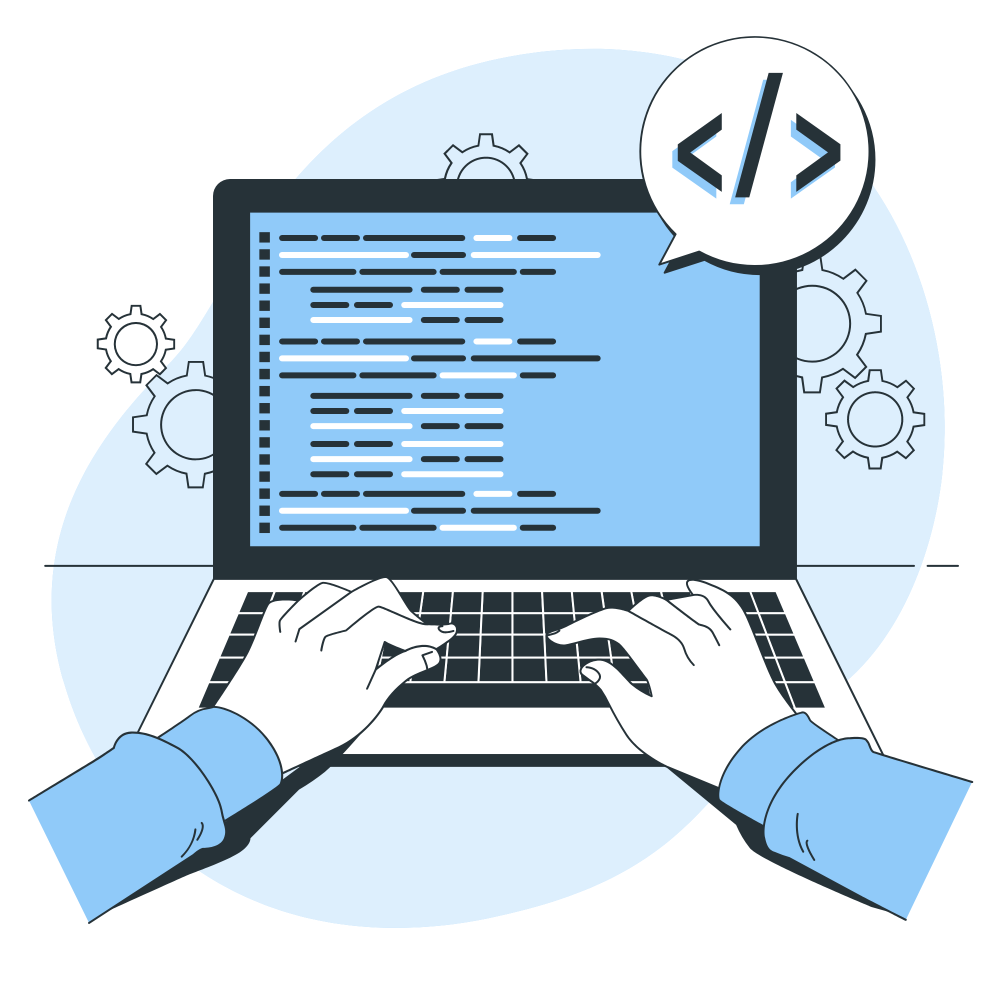

---

&nbsp;
&nbsp;

- 🔭 I’m currently working on side projects
- 🌱 I’m currently learning React and Typescript
- 🥇 I'm currently mastering Vue 
- 💬 Ask me about videogames, e-sport, anime/manga
- ⚡In my free time I like to learn about new technologies
- 🧠 Focused on Clean Code and Best Practices

&nbsp;

&nbsp;

## 🔍 About me
I'm Alex, Full Stack developer from Spain.

## ⭐ Skills

## 📥 Contact
You can contact me through <a href="https://www.linkedin.com/in/alexgallardoescobar/" target="_blank">LinkedIn</a>

<!--

**Alextiintoor/Alextiintoor** is a ✨ _special_ ✨ repository because its `README.md` (this file) appears on your GitHub profile.

Here are some ideas to get you started:

- 🔭 I’m currently working on ...
- 🌱 I’m currently learning ...
- 👯 I’m looking to collaborate on ...
- 🤔 I’m looking for help with ...
- 💬 Ask me about ...
- 📫 How to reach me: ...
- 😄 Pronouns: ...
- ⚡ Fun fact: ...
-->
